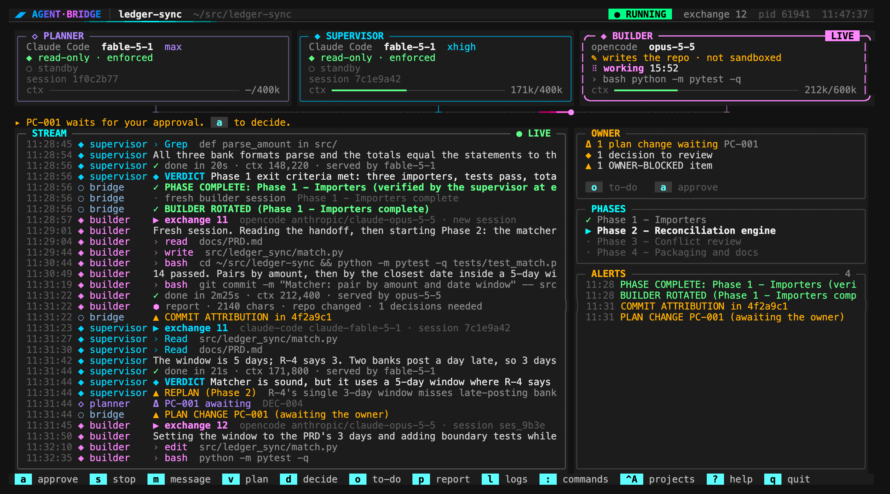
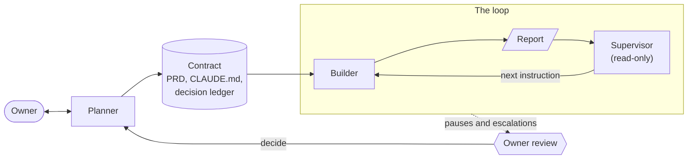

# agent-bridge

A planner, a read-only supervisor and a builder agent work on one git repo, unattended, with an
honest audit trail.

[](https://github.com/Dakuaisu/agent-bridge/actions/workflows/ci.yml)
[](LICENSE)
[](pyproject.toml)
[](pyproject.toml)



*The terminal UI's dashboard, rendered by `scripts/tui_preview.py` from its sample project.*

## Why

Coding agents report "done" on work that isn't. agent-bridge puts a read-only supervisor between
the builder's report and its next instruction, and the supervisor checks each claim against the
repo first. In a smoke test it answered: "Builder's report is false. Claims Phase 1 is complete …
but the repository has no commits". Decisions taken without you are recorded in a decision
ledger, and `agent-bridge review` lists them for you.

## How it works



- **Planner**: interviews you, writes the contract (`docs/PRD.md`, `CLAUDE.md`, the decision
  ledger, `docs/OPEN.md`), and answers re-plan requests and your decisions.
- **Supervisor**: read-only; verifies each builder report against the repo and writes the next
  instruction.
- **Builder**: does the work and commits it.

The loop works from a contract you approve. A material plan change waits for you, and a change
that weakens a threshold always does.

## Features

- **Each role on Claude Code or opencode,** with its own model.
- **A read-only supervisor and planner:** enforced on Claude Code, audited on opencode.
- **Your to-do in one place:** `review` lists what waits for you; `decide` applies your answers.
- **Waits without model calls:** `WAIT FOR PID`, `WAIT FOR FILE`, `WAIT UNTIL`, and usage limits.
- **Builder rotation:** by default, a verified PHASE COMPLETE starts a fresh builder session.
- **For unattended runs:** an optional `verify` command after each builder turn, notifications, a
  cost cap, and a report at PROJECT COMPLETE.
- **Resumable:** a stopped run resumes where it left off; `loop.log` keeps every message as delivered.
- **A terminal UI,** and every action is also a subcommand.
- **Python 3.12+, standard library only.**

## Quick start

You need Python 3.12 or newer and git; the `claude` CLI, logged in (`claude auth status`), for any
role on Claude Code; and opencode **1.18.x** (tested with 1.18.30), with `"autoupdate": false`, for
any role on opencode. 2.x is refused.

```
git clone https://github.com/Dakuaisu/agent-bridge.git && cd agent-bridge
python3.12 -m venv .venv
.venv/bin/pip install -e .            # no runtime dependencies
.venv/bin/agent-bridge --version
ln -s "$PWD/.venv/bin/agent-bridge" ~/.local/bin/agent-bridge   # to run it from any folder

# a first project
mkdir ~/src/myproject && cd ~/src/myproject && git init
git config user.name "Your Name" && git config user.email "you@example.com"
agent-bridge new "A Python CLI that ..."   # the planner interviews you, then asks to approve
```

If you approve, the agents start building. If not, edit `docs/PRD.md` and `CLAUDE.md`, then run
`agent-bridge approve`; it runs until PROJECT COMPLETE or a pause. `agent-bridge` alone opens the
terminal UI. Existing repos, the UI's keys and every command: [docs/USAGE.md](docs/USAGE.md).

## Engines

Each role runs on **Claude Code** (`claude -p`) or **opencode 1.18.x**. Every role defaults to Claude
Code: planner `claude-fable-5-1` at `max` effort, supervisor `claude-fable-5-1` at `xhigh`, builder
`claude-opus-5-5`. Override per role with `ENGINE:MODEL` on `init` or `new`, or later with
`agent-bridge engines` (UI: `e`). These combinations were set up with `init` and passed `check` on
the development machine:

| Combination | Flags | Supervisor read-only |
|---|---|---|
| all Claude Code (default) | none | enforced: `--tools Read,Grep,Glob` |
| Claude Code planner and supervisor, opencode builder | `--builder opencode:anthropic/claude-opus-5-5` | enforced |
| all opencode | `--planner opencode:anthropic/claude-fable-5-1 --supervisor opencode:anthropic/claude-fable-5-1 --builder opencode:anthropic/claude-opus-5-5` | **read-only by instruction only** |

- With any opencode role, `init` picks a free port for `[opencode] port` and adds `.omo/` to
  `.gitignore`; the bridge starts `opencode serve` on that port, or uses one already running.
- On opencode, read-only cannot be enforced; `status` says "read-only by instruction only".
- A role on a non-default model gets no effort setting unless you set `variant` in `bridge.toml`.

## Safety model

Every agent runs as you, with your files, logins and network, and the builder never asks before
acting (Claude Code runs it with `bypassPermissions`, opencode with `--auto`). What limits it:

| Risk | Enforced | Instruction only | Detected after the turn |
|---|---|---|---|
| The supervisor or planner writes | Claude Code: they get only `Read`, `Grep` and `Glob` | opencode | opencode: write and shell calls, and any repo change during their turn, go to `.bridge/review.log` |
| The builder writes outside the repo | Claude Code on macOS: `sandbox-exec` allows writes only to the repo, temp folders and tool caches | every builder message: "Never read, write or commit in any other repository." | writes under your home folder or `/Users`, read from the tool calls (absolute paths, `~`, `$HOME`, `cd`, `git -C`), pause the run. A relative path resolved in another folder shows only as "the builder wrote, but the repo did not change" |
| `git push` | Claude Code: denied by a permission rule while `git.push = "never"`, the default (not yet seen live) | "Never push, and never add a remote." | logged as `DANGER COMMAND` |
| Force push, `git reset --hard`, `rm -rf` on absolute or home paths, `DROP TABLE`, your `safety.danger_commands` | | "Never rewrite history or force-push." | logged as `DANGER COMMAND`; the run continues |
| `Co-Authored-By` or AI attribution in commits | | "No `Co-Authored-By` or AI-attribution lines." | logged as `COMMIT ATTRIBUTION`; nothing rewrites history |
| The contract changes | a plan change may not touch the owner-only settings: `git.push`, `billing.mode`, `project.verify`, the sandbox, `notify.command` | never edit the PRD, `CLAUDE.md` or `bridge.toml`; propose changes instead | the builder's edits to them are logged, and the supervisor is told to have them restored; changes between runs are logged when a run starts |

The sandbox covers writes only: reads, the network and running programs are untouched. **For
unattended runs, run agent-bridge, and with it the builder, in a container or as a separate OS
user** that can reach only the project.

## Billing

- **Claude Code roles bill your Claude subscription (the Max plan).** By default
  (`billing.mode = "subscription"`) the bridge removes `ANTHROPIC_API_KEY` and `ANTHROPIC_AUTH_TOKEN`
  from every child process, and refuses a turn that Claude Code reports as using an API key.
- **Third-party harnesses such as opencode may bill differently.** Anthropic can bill subscription
  use through third-party apps as extra usage, depending on your plan and login. Check your account
  before long runs on opencode.
- **API-key mode:** `billing.mode = "api-key"` in `bridge.toml` (owner-only; the planner may not
  change it) passes the key through, and refuses a Claude Code turn served by the subscription login.

## Status

**Alpha** (0.1.0). What has run live so far:
- Haiku smoke tests in temporary repos: three on Claude Code (the last reached PROJECT COMPLETE)
  and one on opencode.
- One real project: FilingQA moved on 2026-10-06 with the default Claude Code models
  ([docs/MIGRATION.md](docs/MIGRATION.md), section 6). Its first run lasted about 8 minutes (two
  builder turns on `claude-opus-5-5`, one supervisor turn on `claude-fable-5-1`) before it was
  stopped by hand. xbrl-frontier and netcode-testbed have not moved.
- The UI's command log shows init, check, approve, run and stop on that move; its other commands
  were tested only in a pseudo-terminal and with rendered previews.
- Not yet seen on a real project: a planner turn, PHASE COMPLETE, builder rotation, PROJECT
  COMPLETE, sleeps for WAITs or usage limits, `decide`, an opencode role, and what was added
  after that run (the builder sandbox, `project.verify`, notifications, cost tracking).

## Known limitations

- **Read-only on opencode is by instruction only.** It is audited, not enforced.
- **Only a Claude Code builder on macOS is sandboxed,** and the sandbox was checked live with one
  Haiku call in a temporary repo. An opencode builder is not sandboxed (OPEN-004). A write
  through a relative path resolved in another folder is caught only indirectly
  ([INVENTORY](docs/INVENTORY.md) L22, OPEN-003).
- **Commit trailers are detected, not prevented.** In the final smoke test a Haiku builder added
  `Co-Authored-By` despite the rules; the bridge logged `COMMIT ATTRIBUTION`.
- **Phases must be `Phase N` headings** for the bridge to track them (current phase, the
  all-phases-verified hint). Phase plans in tables work for the supervisor, without those aids.
- **opencode 2.x is not supported:** the flags this uses were removed there.
- **Shared logins.** If the `claude` login expires mid-run, the bridge pauses with "run
  `claude login`". It never logs in for you.
- **The terminal UI is keyboard-only,** so your terminal's text selection keeps working. In tmux
  or screen with a ctrl-a prefix, press it twice to send ctrl-a, or use `:` → All projects.

## Docs

- [docs/USAGE.md](docs/USAGE.md): the terminal UI, every command, the settings for unattended runs.
- [docs/DESIGN.md](docs/DESIGN.md), [docs/DECISIONS.md](docs/DECISIONS.md) and
  [docs/OPEN.md](docs/OPEN.md): the design, the decisions taken while building it, open items.
- [docs/MIGRATION.md](docs/MIGRATION.md): moving a project from its old `tools/bridge.py`, and
  what happened on the FilingQA move.

## Development

`.venv/bin/pip install -e '.[dev]'`, then `.venv/bin/python -m pytest`.

[CI](.github/workflows/ci.yml) runs the tests on Ubuntu and macOS with Python 3.12 and 3.13, and on
Linux in a `python:3.12-slim` container with `LANG=en_US.UTF-8` but no locales generated and no
tzdata, where the tests that need a tz database skip. `scripts/smoke.sh claude-code|opencode` runs
all three roles on Haiku in a temporary repo, for a handful of Haiku calls. `scripts/tui_preview.py`
renders the UI's screens to HTML without a terminal or model calls.

## License

[MIT](LICENSE)
